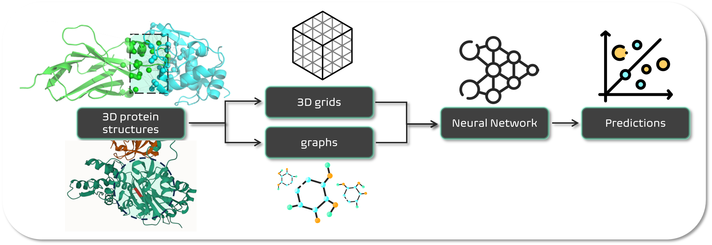

# deeprank-core

[](https://github.com/DeepRank/deeprank-core/actions)
[](https://app.codacy.com/gh/DeepRank/deeprank-core?utm_source=github.com&utm_medium=referral&utm_content=DeepRank/deeprank-core&utm_campaign=Badge_Grade)
[](https://coveralls.io/github/DeepRank/deeprank-core?branch=main)
[](https://zenodo.org/badge/latestdoi/450496579)
[](https://deeprankcore.readthedocs.io/en/latest/?badge=latest)
[](https://badge.fury.io/py/deeprankcore)



## Installation

### Dependencies

Before installing deeprank-core you need to install:

 * [reduce](https://github.com/rlabduke/reduce): follow the instructions in the README of the reduce repository.
    * **How to build it without sudo privileges on a Linux machine**. After having run `make` in the reduce/ root directory, go to reduce/reduce_src/Makefile and modify `/usr/local/` to a folder in your home directory, such as `/home/user_name/apps`. Note that such a folder needs to be added to the PATH in the `.bashrc` file. Then run `make install` from reduce/. 
 * [msms](https://ssbio.readthedocs.io/en/latest/instructions/msms.html): `conda install -c bioconda msms`. *For MacOS with M1 chip users*: you can follow [these instructions](https://ssbio.readthedocs.io/en/latest/instructions/msms.html).
 * [pytorch](https://pytorch.org/): `conda install pytorch -c pytorch`. Note that by default the CPU version of pytorch will be installed, but you can also customize that installation following the instructions on pytorch website.

### deeprank-core installation

Once the dependencies installed, you can install the latest release of deeprank-core using the PyPi package manager:

```
pip install deeprankcore
```

You can get all the new developments by cloning the repo and installing the code with

```
git clone https://github.com/DeepRank/deeprank-core
cd deeprank-core
pip install -e ./
```

## Documentation
The documentation can be found here : https://deeprankcore.rtfd.io/

## Generate Graphs

The process of generating graphs is called preprocessing. In order to do so, one needs query objects, describing how the graphs should be built.

```python
from deeprankcore.preprocess import preprocess
from deeprankcore.models.query import ProteinProteinInterfaceResidueQuery
from deeprankcore.feature import bsa, pssm, amino_acid, biopython

feature_modules = [bsa, pssm, amino_acid, biopython]

queries = []

queries.append(ProteinProteinInterfaceResidueQuery(pdb_path='1ATN_1w.pdb', chain_id1="A", chain_id2="B",
                                                   pssm_paths={"A": "1ATN.A.pdb.pssm", "B": "1ATN.B.pdb.pssm"}))
queries.append(ProteinProteinInterfaceResidueQuery(pdb_path='1ATN_2w.pdb', chain_id1="A", chain_id2="B",
                                                   pssm_paths={"A": "1ATN.A.pdb.pssm", "B": "1ATN.B.pdb.pssm"}))
queries.append(ProteinProteinInterfaceResidueQuery(pdb_path='1ATN_3w.pdb', chain_id1="A", chain_id2="B",
                                                   pssm_paths={"A": "1ATN.A.pdb.pssm", "B": "1ATN.B.pdb.pssm"}))
queries.append(ProteinProteinInterfaceResidueQuery(pdb_path='1ATN_4w.pdb', chain_id1="A", chain_id2="B",
                                                   pssm_paths={"A": "1ATN.A.pdb.pssm", "B": "1ATN.B.pdb.pssm"}))

# run the preprocessing
output_paths = preprocess(feature_modules, queries, "train-data")

# print the paths of the generated files
print(output_paths)

```

The user is free to implement his/her own query class. Each implementation requires the `build_graph` method to be present.


## Graph Interaction Network

Using the graph interaction network is rather simple :


```python
from deeprankcore.NeuralNet import NeuralNet
from deeprankcore.DataSet import HDF5DataSet
from deeprankcore.ginet import GINet
from deeprankcore.models.metrics import OutputExporter, ScatterPlotExporter

database = './hdf5/1ACB_residue.hdf5'

metrics_output_directory = "./metrics"
metrics_exporters = [OutputExporter(metrics_output_directory),
                     ScatterPlotExporter(metrics_output_directory, 5)]

# creating HDF5DataSet object and selecting molecules, node/edge features, target, and clustering method:
dataset = HDF5DataSet(
    root = "./",
    database = database,
    index = range(400),
    node_feature = ["type", "polarity", "bsa", "depth", "hse", "ic", "pssm"],
    edge_feature = ["dist"],
    target = "irmsd",
    clustering_method = "mcl",
)

# training a network using the above defined dataset
nn = NeuralNet(
    dataset,
    GINet,
    task = "reg",
    batch_size = 64,
    percent = [0.8, 0.2],
    metrics_exporters = metrics_exporters
)

nn.train(nepoch = 50, validate = False)
```
## Custom Train-Validation split

It is also possible to define a user-defined function for splitting the dataset in train and validation sets, for example if you want to perform the split according to the peptides clusters (the default split is done after shuffling, according to percent parameter):

```python

def UDF_DivideDataSet(dataset, percent, shuffle):
    ...
    return train_dataset, valid_dataset
```

Then, the user-defined function can be passed to NeuralNet class as parameter:

```python

nn = NeuralNet(
    dataset,
    GINet,
    task = "reg",
    batch_size = 64,
    percent = [0.8, 0.2],
    train_valid_split = UDF_DivideDataSet,
    metrics_exporters = metrics_exporters
)
```

## Custom GNN

It is also possible to define new network architecture and to specify the loss and optimizer to be used during the training.

```python


def normalized_cut_2d(edge_index, pos):
    row, col = edge_index
    edge_attr = torch.norm(pos[row] - pos[col], p=2, dim=1)
    return normalized_cut(edge_index, edge_attr, num_nodes=pos.size(0))


class CustomNet(torch.nn.Module):
    def __init__(self):
        super(Net, self).__init__()
        self.conv1 = SplineConv(d.num_features, 32, dim=2, kernel_size=5)
        self.conv2 = SplineConv(32, 64, dim=2, kernel_size=5)
        self.fc1 = torch.nn.Linear(64, 128)
        self.fc2 = torch.nn.Linear(128, 1)

    def forward(self, data):
        data.x = F.elu(self.conv1(data.x, data.edge_index, data.edge_attr))
        weight = normalized_cut_2d(data.edge_index, data.pos)
        cluster = graclus(data.edge_index, weight)
        data = max_pool(cluster, data)

        data.x = F.elu(self.conv2(data.x, data.edge_index, data.edge_attr))
        weight = normalized_cut_2d(data.edge_index, data.pos)
        cluster = graclus(data.edge_index, weight)
        x, batch = max_pool_x(cluster, data.x, data.batch)

        x = scatter_mean(x, batch, dim=0)
        x = F.elu(self.fc1(x))
        x = F.dropout(x, training=self.training)
        return F.log_softmax(self.fc2(x), dim=1)


device = torch.device('cuda' if torch.cuda.is_available() else 'cpu')

nn = NeuralNet(
    dataset,
    CustomNet,
    batch_size = 64,
    percent = [0.8, 0.2],
    train_valid_split = UDF_DivideDataSet,
    device=device
)
nn.optimizer = torch.optim.Adam(model.parameters(), lr=0.01)
nn.loss = MSELoss()

nn.train(nepoch=50)
```

## h5x support

After installing  `h5xplorer`  (https://github.com/DeepRank/h5xplorer), you can execute the python file `deeprankcore/h5x/h5x.py` to explorer the connection graph used by deeprank-core. The context menu (right click on the name of the structure) allows to automatically plot the graphs using `plotly` as shown below.


## For the developers

### Software release

Before creating a new package release, make sure to have updated all version strings in the source code. An easy way to do it is to run `bump2version [part]` from command line after having installed [bump2version](https://pypi.org/project/bump2version/) on your local environment. Instead of `[part]`, type the part of the version to increase, e.g. minor. The settings in `.bumpversion.cfg` will take care of updating all the files containing version strings. 
