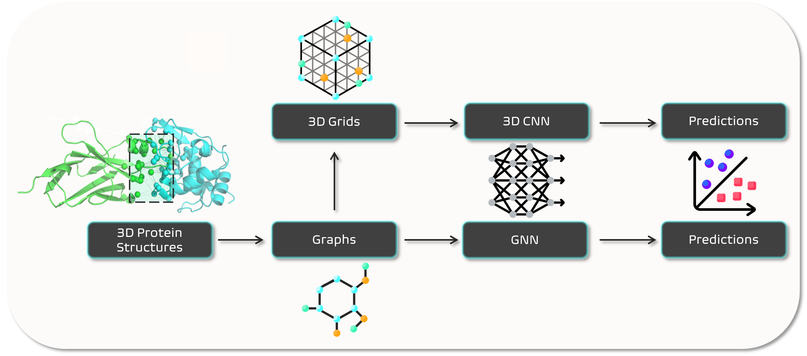

# DeepRank2

|     Badges     |                                                                                                                                                                                                                                                                                                                                                                                                                                                                                                                                                                  |
| :------------: | ---------------------------------------------------------------------------------------------------------------------------------------------------------------------------------------------------------------------------------------------------------------------------------------------------------------------------------------------------------------------------------------------------------------------------------------------------------------------------------------------------------------------------------------------------------------- |
|  **fairness**  | [](https://fair-software.eu) [](https://bestpractices.coreinfrastructure.org/projects/6403)                                                                                                                                                                                                                                |
|  **package**   | [](https://badge.fury.io/py/deeprank2) [](https://app.codacy.com/gh/DeepRank/deeprank2/dashboard?utm_source=gh&utm_medium=referral&utm_content=&utm_campaign=Badge_grade)                                                                                                                                                                                                                                     |
|    **docs**    | [](https://deeprank2.readthedocs.io/en/latest/?badge=latest) [](https://research-software-directory.org/software/deeprankcore) [](https://zenodo.org/badge/latestdoi/450496579) [](https://doi.org/10.21105/joss.05983)                                                                        |
|   **tests**    | [](https://github.com/DeepRank/deeprank2/actions)  [](https://coveralls.io/github/DeepRank/deeprank2?branch=main)  <!---  --> |
| **running on** |                                                                                                                                                                                                                                                                                                                                                                                                                                                             |
|  **license**   | [](https://opensource.org/license/apache-2-0/)                                                                                                                                                                                                                                                                                                                                                                                                                                               |

## Overview

<p align="center">
  
</p>

DeepRank2 is an open-source deep learning (DL) framework for data mining of protein-protein interfaces (PPIs) or single-residue variants (SRVs). This package is an improved and unified version of three previously developed packages: [DeepRank](https://github.com/DeepRank/deeprank), [DeepRank-GNN](https://github.com/DeepRank/Deeprank-GNN), and [DeepRank-Mut](https://github.com/DeepRank/DeepRank-Mut).

As input, DeepRank2 takes [PDB-formatted](https://www.cgl.ucsf.edu/chimera/docs/UsersGuide/tutorials/pdbintro.html) atomic structures, and map them to graphs, where nodes can represent either residues or atoms, as chosen by the user, and edges represent the interactions between them. DeepRank2 has the option to choose between two types of queries as input for the featurization phase:

- PPIs, for mining interaction patterns within protein-protein complexes, implemented by the `ProteinProteinInterfaceQuery` class;
- SRVs, for mining mutation phenotypes within protein structures, implemented by the `SingleResidueVariantQuery` class.

The physico-chemical and geometrical features are then computed and assigned to each node and edge. The user can choose which features to generate from several pre-existing options defined in the package, or define custom features modules, as explained in the documentation. The graphs can then be mapped to 3D-grids as well. The generated data can be used for training neural networks. DeepRank2 also offers a pre-implemented training pipeline, using either [CNNs](https://en.wikipedia.org/wiki/Convolutional_neural_network) (for 3D-grids) or [GNNs](https://en.wikipedia.org/wiki/Graph_neural_network) (for graphs), as well as output exporters for evaluating performances.

Main features:

- Predefined atom-level and residue-level feature types
  - e.g. atom/residue type, charge, size, potential energy
  - All features' documentation is available [here](https://deeprank2.readthedocs.io/en/latest/features.html)
- Predefined target types
  - binary class, CAPRI categories, DockQ, RMSD, and FNAT
  - Detailed docking scores documentation is available [here](https://deeprank2.readthedocs.io/en/latest/docking.html)
- Flexible definition of both new features and targets
- Features generation for both graphs and 3D-grids
- Efficient data storage in HDF5 format
- Support for both classification and regression (based on [PyTorch](https://pytorch.org/) and [PyTorch Geometric](https://pytorch-geometric.readthedocs.io/en/latest/))

📚 [Documentation](https://deeprank2.rtfd.io/)

📣 [Discussions](https://github.com/DeepRank/deeprank2/discussions)

## Table of contents

- [DeepRank2](#deeprank2)
  - [Overview](#overview)
  - [Table of contents](#table-of-contents)
  - [Installation](#installation)
    - [Containerized Installation](#containerized-installation)
    - [Local/remote installation](#localremote-installation)
      - [YML file installation (recommended)](#yml-file-installation-recommended)
      - [Manual installation (customizable)](#manual-installation-customizable)
      - [Testing DeepRank2 installation](#testing-deeprank2-installation)
  - [Contributing](#contributing)
  - [Using DeepRank2](#using-deeprank2)
    - [Data generation](#data-generation)
    - [Datasets](#datasets)
      - [GraphDataset](#graphdataset)
      - [GridDataset](#griddataset)
    - [Training](#training)
      - [Run a pre-trained model on new data](#run-a-pre-trained-model-on-new-data)
  - [Computational performances](#computational-performances)
  - [Package development](#package-development)

## Installation

There are two ways to install DeepRank2:

1. In a [dockerized container](#containerized-installation). This allows you to use DeepRank2, including all the notebooks within the container (a protected virtual space), without worrying about your operating system or installation of dependencies.
   - We recommend this installation for inexperienced users and to learn to use or test our software, e.g. using the provided [tutorials](tutorials/TUTORIAL.md). However, resources might be limited in this installation and we would not recommend using it for large datasets or on high-performance computing facilities.
2. [Local installation](#localremote-installation) on your system. This allows you to use the full potential of DeepRank2, but requires a few additional steps during installation.
   - We recommend this installation for more experienced users, for larger projects, and for (potential) [contributors](#contributing) to the codebase.

### Containerized Installation

In order to try out the package without worrying about your OS and without the need of installing all the required dependencies, we created a `Dockerfile` that can be used for taking care of everything in a suitable container.

For this, you first need to install [Docker](https://docs.docker.com/engine/install/) on your system. Then run the following commands. You may need to have sudo permission for some steps, in which case the commands below can be preceded by `sudo`:

```bash
# Clone the DeepRank2 repository and enter its root directory
git clone https://github.com/DeepRank/deeprank2
cd deeprank2

# Build and run the Docker image
docker build -t deeprank2 .
docker run -p 8888:8888 deeprank2
```

Next, open a browser and go to `http://localhost:8888` to access the application running inside the Docker container. From there you can use DeepRank2, e.g. to run the tutorial notebooks.

More details about the tutorials' contents can be found [here](https://github.com/DeepRank/deeprank2/blob/main/tutorials/TUTORIAL.md). Note that in the docker container only the raw PDB files are downloaded, which needed as a starting point for the tutorials. You can obtain the processed HDF5 files by running the `data_generation_xxx.ipynb` notebooks. Because Docker containers are limited in memory resources, we limit the number of data points processed in the tutorials. Please [install the package locally](#localremote-installation) to fully leverage its capabilities.

If after running the tutorials you want to remove the (quite large) Docker image from your machine, you must first [stop the container](https://docs.docker.com/engine/reference/commandline/stop/) and can then [remove the image](https://docs.docker.com/engine/reference/commandline/image_rm/). More general information about Docker can be found on the [official website docs](https://docs.docker.com/get-started/).

### Local/remote installation

Local installation is formally only supported on the latest stable release of ubuntu, for which widespread automated testing through continuous integration workflows has been set up. However, it is likely that the package runs smoothly on other operating systems as well.

Before installing DeepRank2 please ensure you have [GCC](https://gcc.gnu.org/install/) installed: if running `gcc --version` gives an error, run `sudo apt-get install gcc`.

#### YML file installation (recommended)

You can use the provided YML file for creating a [conda environment](https://conda.io/projects/conda/en/latest/user-guide/tasks/manage-environments.html) via [mamba](https://mamba.readthedocs.io/en/latest/installation/mamba-installation.html), containing the latest stable release of DeepRank2 and all its dependencies.
This will install the CPU-only version of DeepRank2 on Python 3.10.
Note that this will not work for MacOS. Do the [Manual Installation](#manual-installation) instead.

```bash
# Create the environment
mamba env create -f https://raw.githubusercontent.com/DeepRank/deeprank2/main/env/deeprank2.yml
# Activate the environment
conda activate deeprank2
# Install the latest deeprank2 release
pip install deeprank2
```

We also provide a frozen environment YML file located at `env/deeprank2_frozen.yml` with all dependencies set to fixed versions. The `env/deeprank2_frozen.yml` file provides a frozen environment with all dependencies set to fixed versions. This ensures reproducibility of experiments and results by preventing changes in package versions that could occur due to updates or modifications in the default `env/deeprank2.yml`. Use this frozen environment file for a stable and consistent setup, particularly if you encounter issues with the default environment file.

#### Manual installation (customizable)

If you want to use the GPUs, choose a specific python version (note that at the moment we support python 3.10 only), are a MacOS user, or if the YML installation was not successful, you can install the package manually. We advise to do this inside a [conda virtual environment](https://conda.io/projects/conda/en/latest/user-guide/tasks/manage-environments.html).

You can first create a copy of the `deeprank2.yml` file, place it in your current directory, and remove the packages that cannot be installed properly, or the ones that you want to install differently (e.g., pytorch-related packages if you wish to install the CUDA version), and then proceed with the environment creation by using the edited YML file: `conda env create -f deeprank2.yml` or `mamba env create -f deeprank2.yml`, if you have [mamba](https://mamba.readthedocs.io/en/latest/installation/mamba-installation.html) installed. Then activate the environment, and proceed with installing the missing packages, which might fall into the following list. If you have any issues during installation of dependencies, please refer to the official documentation for each package (linked below), as our instructions may be out of date (last tested on 19 Feb 2024):

- [MSMS](https://anaconda.org/bioconda/msms): [Here](https://ssbio.readthedocs.io/en/latest/instructions/msms.html) for MacOS with M1 chip users.
- [PyTorch](https://pytorch.org/get-started/locally/)
  - Pytorch regularly publishes updates and not all newest versions will work stably with DeepRank2. Currently, the package is tested on ubuntu using [PyTorch 2.1.1](https://pytorch.org/get-started/previous-versions/#v211).
  - We support torch's CPU library as well as CUDA.
- [PyG](https://pytorch-geometric.readthedocs.io/en/latest/install/installation.html) and its optional dependencies: `torch_scatter`, `torch_sparse`, `torch_cluster`, `torch_spline_conv`.
  - The exact command to install pyg will depend on the version of pytorch you are using. Please refer to the source's installation instructions (we recommend using the pip installation for this as it also shows the command for the dependencies).
- [FreeSASA](https://freesasa.github.io/python/).

Finally install deeprank2 itself: `pip install deeprank2`.

Alternatively, get the latest updates by cloning the repo and installing the editable version of the package with:

```bash
git clone https://github.com/DeepRank/deeprank2
cd deeprank2
pip install -e .'[test]'
```

The `test` extra is optional, and can be used to install test-related dependencies, useful during development.

#### Testing DeepRank2 installation

If you have cloned the repository, you can check that all components were installed correctly using `pytest`. We especially recommend doing this in case you installed DeepRank2 and its dependencies manually (the latter option above).

The quick test should be sufficient to ensure that the software works, while the full test (a few minutes) will cover a much broader range of settings to ensure everything is correct.

First run `pip install pytest`, if you did not install it above. Then run `pytest tests/test_integration.py` for the quick test or just `pytest` for the full test (expect a few minutes to run).

## Contributing

If you would like to contribute to the package in any way, please see [our guidelines](CONTRIBUTING.rst).

## Using DeepRank2

The following section serves as a first guide to start using the package, using protein-protein Interface (PPI) queries as example. For an enhanced learning experience, we provide in-depth [tutorial notebooks](https://github.com/DeepRank/deeprank2/tree/main/tutorials) for generating PPI data, generating SVR data, and for the training pipeline.
For more details, see the [extended documentation](https://deeprank2.rtfd.io/).

### Data generation

For each protein-protein complex (or protein structure containing a missense variant), a `Query` can be created and added to the `QueryCollection` object, to be processed later on. Two subtypes of `Query` exist: `ProteinProteinInterfaceQuery` and `SingleResidueVariantQuery`.

A `Query` takes as inputs:

- A `.pdb` file, representing the molecular structure.
- The resolution (`"residue"` or `"atom"`), i.e. whether each node should represent an amino acid residue or an atom.
- `chain_ids`, the chain ID or IDs (generally single capital letter(s)).
  - `SingleResidueVariantQuery` takes a single ID, which represents the chain containing the variant residue.
  - `ProteinProteinInterfaceQuery` takes a pair of ids, which represent the chains between which the interface exists.
  - Note that in either case this does not limit the structure to residues from this/these chain/s. The structure contained in the `.pdb` can thus have any number of chains, and residues from these chains will be included in the graphs and 3D-grids produced by DeepRank2 (if they are within the `influence_radius`).
- Optionally, the correspondent position-specific scoring matrices (PSSMs), in the form of `.pssm` files.

```python
from deeprank2.query import QueryCollection, ProteinProteinInterfaceQuery

queries = QueryCollection()

# Append data points
queries.add(ProteinProteinInterfaceQuery(
    pdb_path = "tests/data/pdb/1ATN/1ATN_1w.pdb",
    resolution = "residue",
    chain_ids = ["A", "B"],
    targets = {
        "binary": 0
    },
    pssm_paths = {
        "A": "tests/data/pssm/1ATN/1ATN.A.pdb.pssm",
        "B": "tests/data/pssm/1ATN/1ATN.B.pdb.pssm"
    }
))
queries.add(ProteinProteinInterfaceQuery(
    pdb_path = "tests/data/pdb/1ATN/1ATN_2w.pdb",
    resolution = "residue",
    chain_ids = ["A", "B"],
    targets = {
        "binary": 1
    },
    pssm_paths = {
        "A": "tests/data/pssm/1ATN/1ATN.A.pdb.pssm",
        "B": "tests/data/pssm/1ATN/1ATN.B.pdb.pssm"
    }
))
queries.add(ProteinProteinInterfaceQuery(
    pdb_path = "tests/data/pdb/1ATN/1ATN_3w.pdb",
    resolution = "residue",
    chain_ids = ["A", "B"],
    targets = {
        "binary": 0
    },
    pssm_paths = {
        "A": "tests/data/pssm/1ATN/1ATN.A.pdb.pssm",
        "B": "tests/data/pssm/1ATN/1ATN.B.pdb.pssm"
    }
))

```

The user is free to implement a custom query class. Each implementation requires the `build` method to be present.

The queries can then be processed into graphs only or both graphs and 3D-grids, depending on which kind of network will be used later for training.

```python
from deeprank2.features import components, conservation, contact, exposure, irc, surfacearea
from deeprank2.utils.grid import GridSettings, MapMethod

feature_modules = [components, conservation, contact, exposure, irc, surfacearea]

# Save data into 3D-graphs only
hdf5_paths = queries.process(
    "<output_folder>/<prefix_for_outputs>",
    feature_modules = feature_modules)

# Save data into graphs and 3D-grids
hdf5_paths = queries.process(
    "<output_folder>/<prefix_for_outputs>",
    feature_modules = feature_modules,
    grid_settings = GridSettings(
        # the number of points on the x, y, z edges of the cube
        points_counts = [20, 20, 20],
        # x, y, z sizes of the box in Å
        sizes = [1.0, 1.0, 1.0]),
    grid_map_method = MapMethod.GAUSSIAN)
```

### Datasets

Data can be split in sets implementing custom splits according to the specific application. Assuming that the training, validation and testing ids have been chosen (keys of the HDF5 file/s), then the `DeeprankDataset` objects can be defined.

#### GraphDataset

For training GNNs the user can create a `GraphDataset` instance:

```python
from deeprank2.dataset import GraphDataset

node_features = ["bsa", "res_depth", "hse", "info_content", "pssm"]
edge_features = ["distance"]
target = "binary"
train_ids = [<ids>]
valid_ids = [<ids>]
test_ids = [<ids>]

# Creating GraphDataset objects
dataset_train = GraphDataset(
    hdf5_path = hdf5_paths,
    subset = train_ids,
    node_features = node_features,
    edge_features = edge_features,
    target = target
)
dataset_val = GraphDataset(
    hdf5_path = hdf5_paths,
    subset = valid_ids,
    train_source = dataset_train
)
dataset_test = GraphDataset(
    hdf5_path = hdf5_paths,
    subset = test_ids,
    train_source = dataset_train
)
```

#### GridDataset

For training CNNs the user can create a `GridDataset` instance:

```python
from deeprank2.dataset import GridDataset

features = ["bsa", "res_depth", "hse", "info_content", "pssm", "distance"]
target = "binary"
train_ids = [<ids>]
valid_ids = [<ids>]
test_ids = [<ids>]

# Creating GraphDataset objects
dataset_train = GridDataset(
    hdf5_path = hdf5_paths,
    subset = train_ids,
    features = features,
    target = target
)
dataset_val = GridDataset(
    hdf5_path = hdf5_paths,
    subset = valid_ids,
    train_source = dataset_train,
)
dataset_test = GridDataset(
    hdf5_path = hdf5_paths,
    subset = test_ids,
    train_source = dataset_train,
)
```

### Training

Let's define a `Trainer` instance, using for example of the already existing `GINet`. Because `GINet` is a GNN, it requires a dataset instance of type `GraphDataset`.

```python
from deeprank2.trainer import Trainer
from deeprank2.neuralnets.gnn.vanilla_gnn import VanillaNetwork

trainer = Trainer(
    VanillaNetwork,
    dataset_train,
    dataset_val,
    dataset_test
)

```

The same can be done using a CNN, for example `CnnClassification`. Here a dataset instance of type `GridDataset` is required.

```python
from deeprank2.trainer import Trainer
from deeprank2.neuralnets.cnn.model3d import CnnClassification

trainer = Trainer(
    CnnClassification,
    dataset_train,
    dataset_val,
    dataset_test
)
```

By default, the `Trainer` class creates the folder `./output` for storing predictions information collected later on during training and testing. `HDF5OutputExporter` is the exporter used by default, but the user can specify any other implemented exporter or implement a custom one.

Optimizer (`torch.optim.Adam` by default) and loss function can be defined by using dedicated functions:

```python
import torch

trainer.configure_optimizers(torch.optim.Adamax, lr = 0.001, weight_decay = 1e-04)

```

Then the `Trainer` can be trained and tested; the best model in terms of validation loss is saved by default, and the user can modify so or indicate where to save it using the `train()` method parameter `filename`.

```python
trainer.train(
    nepoch = 50,
    batch_size = 64,
    validate = True,
    filename = "<my_folder/model.pth.tar>")
trainer.test()

```

#### Run a pre-trained model on new data

If you want to analyze new PDB files using a pre-trained model, the first step is to process and save them into HDF5 files [as we have done above](#data-generation).

Then, the `DeeprankDataset` instance for the newly processed data can be created. Do this by specifying the path for the pre-trained model in `train_source`, together with the path to the HDF5 files just created. Note that there is no need of setting the dataset's parameters, since they are inherited from the information saved in the pre-trained model. Let's suppose that the model has been trained with `GraphDataset` objects:

```python
from deeprank2.dataset import GraphDataset

dataset_test = GraphDataset(
    hdf5_path = "<output_folder>/<prefix_for_outputs>",
    train_source = "<pretrained_model_path>"
)
```

Finally, the `Trainer` instance can be defined and the new data can be tested:

```python
from deeprank2.trainer import Trainer
from deeprank2.neuralnets.gnn.vanilla_gnn import VanillaNetwork
from deeprank2.utils.exporters import HDF5OutputExporter

trainer = Trainer(
    VanillaNetwork,
    dataset_test = dataset_test,
    pretrained_model = "<pretrained_model_path>",
    output_exporters = [HDF5OutputExporter("<output_folder_path>")]
)

trainer.test()
```

For more details about how to run a pre-trained model on new data, see the [docs](https://deeprank2.readthedocs.io/en/latest/getstarted.html#run-a-pre-trained-model-on-new-data).

## Computational performances

We measured the efficiency of data generation in DeepRank2 using the tutorials' [PDB files](https://zenodo.org/record/8187806) (~100 data points per data set), averaging the results run on Apple M1 Pro, using a single CPU.
Parameter settings were: atomic resolution, `distance_cutoff` of 5.5 Å, radius (for SRV only) of 10 Å. The [features modules](https://deeprank2.readthedocs.io/en/latest/features.html) used were `components`, `contact`, `exposure`, `irc`, `secondary_structure`, `surfacearea`, for a total of 33 features for PPIs and 26 for SRVs (the latter do not use `irc` features).

|      |            Data processing speed <br />[seconds/structure]             |                   Memory <br />[megabyte/structure]                    |
| ---- | :--------------------------------------------------------------------: | :--------------------------------------------------------------------: |
| PPIs | graph only: **2.99** (std 0.23) <br />graph+grid: **11.35** (std 1.30) | graph only: **0.54** (std 0.07) <br />graph+grid: **16.09** (std 0.44) |
| SRVs | graph only: **2.20** (std 0.08) <br />graph+grid: **2.85** (std 0.10)  | graph only: **0.05** (std 0.01) <br />graph+grid: **17.52** (std 0.59) |

## Package development

If you're looking for developer documentation, go [here](https://github.com/DeepRank/deeprank2/blob/dev/README.dev.md).
