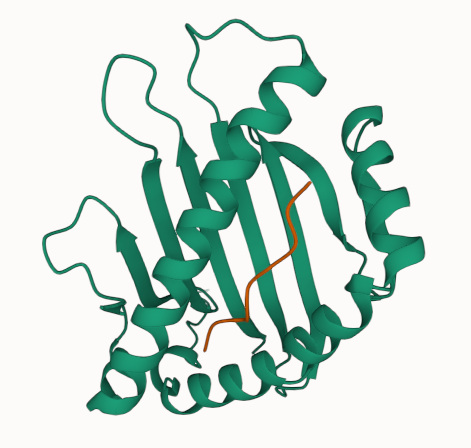

## Introduction

The tutorial notebooks in this folder can be run to learn how to use DeepRank-Core.
- There are two tutorial notebooks for data generation, which demonstrate how to create *.hdf5-formatted input training data from raw *.pdb-formatted data using DeepRank2.
  - protein-protein interface (PPI) data ([data_generation_ppi.ipynb](https://github.com/DeepRank/deeprank2/blob/main/tutorials/data_generation_ppi.ipynb));
  - missense variants data ([data_generation_variant.ipynb](https://github.com/DeepRank/deeprank2/blob/main/tutorials/data_generation_variant.ipynb)). 
- The [training tutorial](tutorials/training_ppi.ipynb) will demonstrate how to train neural networks using DeepRank2.

### Use cases

#### PPIs

The example dataset for PPIs that we provide contains 100 PDB files, each representing the structure of a [Major Histocompatibility Complex (MHC) protein](https://en.wikipedia.org/wiki/Major_histocompatibility_complex) with a peptide in its binding pocket. This structure may or may not represent a bound state between the two molecules, forming a peptide-MHC (pMHC) complex. We are interested in predicting the binding affinity (BA) of potential pMHC complexes, which play a key role in T-cell immunity.

PDB models used in this tutorial have been generated with [PANDORA](https://github.com/X-lab-3D/PANDORA), an anchor restrained modeling pipeline for generating peptide-MHC structures. While target data, (i.e., the BA values) for such pMHC complexes, have been retrieved from [MHCFlurry 2.0](https://data.mendeley.com/datasets/zx3kjzc3yx).

On the left an example of a pMHC structure is shown, rendered using [ProteinViewer](https://marketplace.visualstudio.com/items?itemName=ArianJamasb.protein-viewer). The MHC protein is displayed in green, while the peptide is in orange.

#### Missense variants

The example missense variants dataset that we provide contains 58 PDB files, each representing protein structures containing one or multiple missense variants, which derive from alterations in the coding regions of the DNA. For each missense variant, we are interested in predicting whether the phenotypic outcome is pathogenic or neutral.

PDB models and target data used in this tutorial have been retrieved from [Ramakrishnan et al.](https://doi.org/10.3389/fmolb.2023.1204157).

## Setup

1. Follow [these instructions](https://github.com/DeepRank/deeprank2#dependencies) to install the necessary package dependencies.
   - We recommend installing `deeprank2` and all its dependencies into a [conda](https://docs.conda.io/en/latest/) environment.
2. Once the dependencies are installed, you can install the tutorials' version of the package:
   - Clone the [deeprank2 repository](https://github.com/DeepRank/deeprank2).
   - From within the repository, run `pip install ".[tutorials]"`
3. To test whether the package has been succesfully installed:
   - Navigate to your deeprank2 folder.
   - Run `pytest tests`. All tests should pass at this point.

## Running the notebooks

The tutorial notebooks can be run:
- from inside your IDE, if it has that functionality (e.g., VS Code),
- on JupyterLab by navigating to the tutorials directory in your terminal and running `jupyter-lab`.
